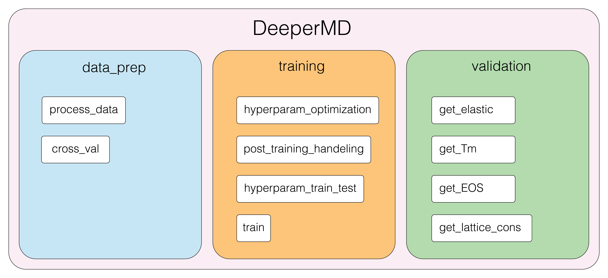
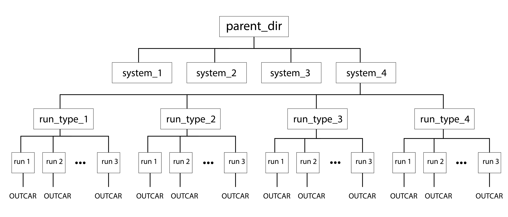

# DeeperMD Package 

This package builds on the features provided in the Machine learning interatomic potential (MLIP) development package, DeepMD, streamlining the data preparation, model training, and model validation. By interfacing with dpdata (data preparation package), LAMMPS (molecular dynamics software), and deepmd (MLIP software), the DeeperMD package cleans up the model development process. New functionalities like hyperparameter optimization are included in the package to optimize model parameters.

## Data Preparation Sub-Package
Separated into two modules: `process_data` and `cross_val`

This subpackage reads in DFT data (currently only OUTCARs supported), and processes them for use in ML-based potentials. 
#### process_data

converts OUTCARs to `.npy` via `dpdata` package, separating data into training and validation directories based on a defined training split proportion.

==**NOTE**==
This package requires the below directory tree structure for the unprocessed data:

An option is available for the inclusion of `sub_dirs` if multiple `parent_dir` are present. In this case, the `parent_dir` would be the parent of the `sub_dirs`.

#### `OUTCAR_to_ms`

converts OUTCARs from given `parent_directory` to DeepMD MultiSystem() object for storage of systems and data management.

#### `train_test_split`

scrubs through a directory with `.npy` files and splits them into training and validation directories.

#### `OUTCAR_to_npy`

Combines the above functions in one end-to-end method to simplify data preparation stage.

### gen_cval_data
This sub-module splits training and validation data into k-sets for use in k-fold cross-validation. This is a mostly back-end package for use in hyperparameter optimization data preparation.

#### `gen_data_dir` 
Generates directory of data split into `k` folds.

[GIVE DIRECTORY TREE OF RESULTING DATABASE]

#### `k_split` 
Splits given `.npy` data into `k` folds 

### Training Models 

### Model evaluation
