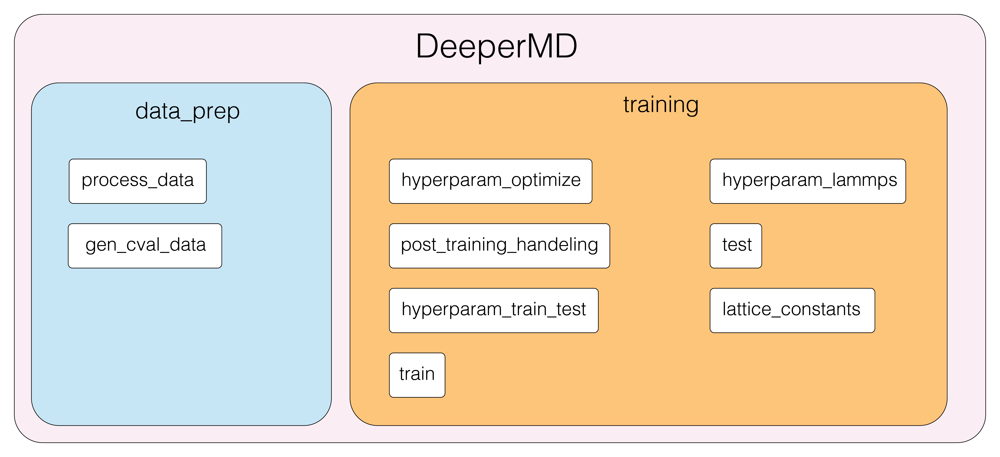
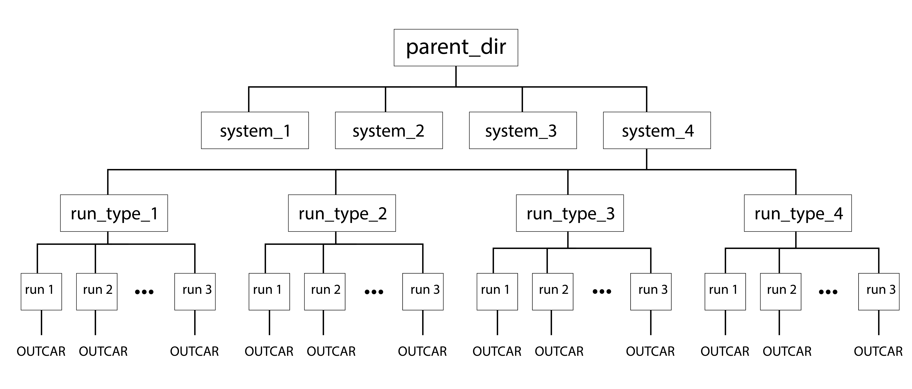
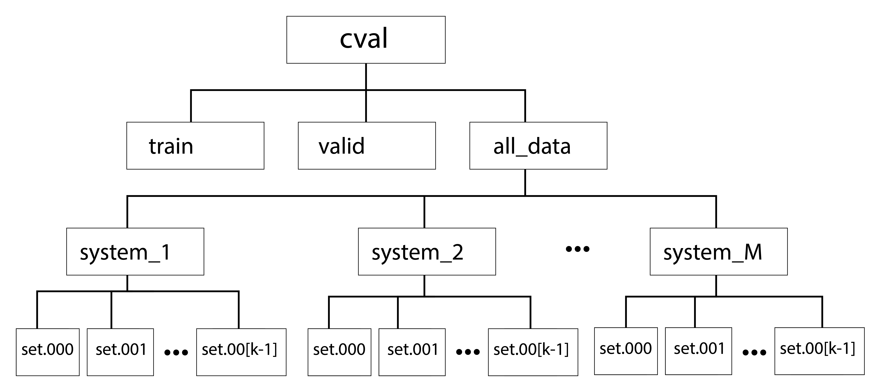

# DeeperMD Package 

Go through the `walkthrough_example` jupyter notebook for a step-by-step walkthrough of the deepermd package capabilities.

This package builds on the features provided in the Machine learning interatomic potential (MLIP) development package, DeepMD, streamlining the data preparation, model training, and model validation. By interfacing with dpdata (data preparation package), LAMMPS (molecular dynamics software), and deepmd (MLIP software), the DeeperMD package cleans up the model development process. New functionalities like hyperparameter optimization are included in the package to optimize model parameters.

## Data Preparation Sub-Package
Separated into two modules: `process_data` and `cross_val`

This subpackage reads in DFT data (currently only OUTCARs supported), and processes them for use in ML-based potentials. 
#### process_data

converts OUTCARs to `.npy` via `dpdata` package, separating data into training and validation directories based on a defined training split proportion.

**NOTE**
This package requires the below directory tree structure for the unprocessed data:

An option is available for the inclusion of `sub_dirs` if multiple `parent_dir` are present. In this case, the `parent_dir` would be the parent of the `sub_dirs`.

#### `OUTCAR_to_ms`

converts OUTCARs from given `parent_directory` to DeepMD MultiSystem() object for storage of systems and data management.

##### Args:
> `parent_dir (str)`: 
  >> path to parent directory to all raw data
    
> `sub_dirs (list, optional)`: 
  >> potential existence of subdirs within parent (see Requirements in NOTE). Defaults to [''].

> `run_types (list, optional)`: 
  >> run types within parent to include in data. Defaults to ['all'].

> `flags (list, optional)`: 
  >> flags indicating OUTCAR selection, must be file in OUTCAR folder. Defaults to ['OUTCAR'].

#### `find_missing`
Finds missing numbers given `sub_list` and max value of `full_list`

##### Args:
>sub_list (list)): 
>>subset of list 
>full_list (int): 
>>max value of full list to compare against sub_list

##### Returns:
> list:
>> list of values in (0,full_list} that are not in sub_list

#### `train_test_split`

scrubs destination dir for `.npy` files and splits into train-test sets

##### Args:
> `destination_dir (str)`: 
>>path to destination directory to write training and validation folders.

> `train_split (float,optional)`: 
>> proportion of data to reserve for training. Defaults to 0.9.

> `ms_virial (MultiSystem())`: 
>> MultiSystem() object containing systems with virials.

> `ms (MultiSystem())`: 
>>MultiSystem() object containing systems without virials.

**NOTE** : requires that .npy are already in destination dir tree

#### `OUTCAR_to_npy`

reads in data from OUTCAR output from VASP and converts to .npy files in training and validation folders.

##### Args:
>`parent_dir (str)`: 
>>path to parent directory to all raw data

>`destination_dir (str)`: 
>>path to destination directory to write training and validation folders

>`sub_dirs (list, optional)`: 
>>potential existence of subdirs within parent (see Notes). Defaults to [''].

>`run_types (list, optional)`: 
>>run types within parent to include in data. Defaults to ['all'].

>`flags (list, optional)`: 
>>flags indicating OUTCAR selection, must be file in OUTCAR folder. Defaults to ['OUTCAR'].

>`train_split (float, optional)`: 
>>proportion of data to reserve for training. Defaults to 0.9.

##### Raises:
> `Exception`: 
>> given parent directory does not exist

### gen_cval_data
This sub-module splits training and validation data into k-sets for use in k-fold cross-validation. This is a mostly back-end package for use in hyperparameter optimization data preparation.

#### `gen_data_dir` 
Generates directory of data split evenly and randomly into `k` folds.

#### `k_split` 
split `full_list` into `k` random subsets

##### Args:
>`full_list (list)`: 
>>full list to be sliced into `k` subsets

>`k (int)`: 
>>number of subsets to slice `full_list` into

##### Returns:
>`dict`: 
>>dictionary with `k` keys pointing to `k` subsets of full_list

## Training Model Sub-Package
Training sub-package, functions are separated into three modules: train.py, hyperparam_train_test.py, and post_training_handling.py.

### `train` module
train.py includes a single function, 'train.' This function is used to train neural network models. 
####  `train`
Function responsible for model training.
##### Args:
> `input_script (json file)`:
>>Input json that features required neural network parameters. 
>>File is in dictionary format and should follow the structure outlined by the DeepMD package.

>`directory (str)`:
>>Directory where function should be executed in, this directory should contain the input_script file.

## hyperparam_train_test module
hyperparam_train_test.py features a collection functions that areused for neural nework hyperparameter optimization. Functionality includesgenerating input json files for hyperparameter grid search, model training,
model testing (energy error metric), and model evaluation via moleculardynamics simulations using the LAMMPS software. These main features canbe used independently or in tandem with one another via a wrapped function
included at the end of the file. Outside of the main functionality described here, there are additional functions included/developed for
more seamless development

####  `log_maker`
Function generates a log file, used for logging purposes
as functions run.
##### Args:
>`file_name (str)`:
>>Desired file name where log messages should be appended.

#### `set_switcher`
For effective cross validation, validation sets must be substituted in and out of system training folders. This function aims to retain the folder structure DeepMD requires for model training by moving specified sets (validation sets) to their respective system validation folders. To use this function the data must have been prepared using the data_prep module.
##### **Args**:
>`path_to_cval (str)`:
>>Path to where data generated using gen_cval_data function is.

>`switch_set_index (int)`:
>>Index of set list, this index will be set to the validation set.

####  `set_return`

This function moves all files within systems train and valid foldersback to their respective system folders within the all_data folder produced via the data_prep module.
##### Args:
> `path_to_cval (str)`:
>>Path to where data generated using gen_cval_data function is.

####  `getFromDict`

Function evaluates whether provided key to modify exists in base_json.
##### Args: 
> `base_json (json file)`:
>>Base json that will be modified with keys/values set by the user.

>`key_list (list)`:
>>List of key to check within the base_json file.

####  `setInDict`

Function modifies base json with key value pair specified by the user.
##### Args: 
> `base_json (json file)`:
>>Base json that will be modified with keys/values set by the user.

> `key_list (list)`:
>>List of key to check within the base_json file.

>`value (list, numeric)`:
>>Value/values to be changed.

####  `json_dir_gen_1d`

Function will modify a base json file with values specified by the user in the provided param_dict dictionary. Function will create directories to store these json files. 
##### Args:
>`base_json (json file)`:
>>Base json file to be modified, all parameters to be modified
>>must be present in this json. Parameters that will not be optimized, such as parameters with only value/set of values to be tested, should have this value/set of values set in the base json.

>`param_dict (dict)`:
>>Dictionary with parameters to be modified. Should be one dictionary, NO NESTED dictionaries. Dictionary keys should be strings of space separated keys. Values should be lists.

>`path_to_cval (str)`:
>>Path to data.

>`gen_cval_data (bool)`:
>>Whether data was generated using `gen_cval_data` function within the `data_prep` module. If `True` training and validation paths will be made by appending "train" and "valid" to the provided `path_to_cval` path, making the training and validation paths, respectively. 
>>`path_to_cval` must be provided if `cval` set to `True`.

>`crossval (bool)`:
>>Whether cross validation sub directories and jsons should be made.

>`d1_dir (str)`:
>>Name of 1-dimensional gridsearch directory. This directory is where all jsons and models will be stored. Sub directories pertaining to each parameter and their various values will be made to store individual jsons and files.

####  `hyperparam_train`

This function trains models using input json files that were created in order to perform a 1d hyperparameter optimization/evaluation study.

There are options for model compression and cross-validation. 

##### Args:
> `directory (str)`:
>>Parent directory, where script will be run.

>`d1_dir (str)`:
>>directory name for 1d gridsearch.

>`path_to_cval (str or None)`:
>>Path to data generated via gen_cval_data function. Must use gen_cval_data function if crossval is to be used.

>`compression (Bool, optional)`:
>>Whether models will be compressed. The default is False. If using type embedding set to False.

>`crossval (Bool, optional)`:
>>Whether cross-validation will be employed. The default is True. 
>>Only use if cross-validation sets were generated.

>`frozen_model (str, optional)`:
>>Name of frozen model. The default is 'graph.pb'.

>`compressed_model (str, optional)`:
>>Name of compressed model. The default is `'graph_compress.pb'`.

####  `hyperparam_test`

This function evaluates trained models predictive performance by measuring their RMSE on validation data. The error metrics are written to a text file. 
##### Args:
>`directory (str)`:
>>Directory where script that executes this function is.

>`d1_dir (str)`:
>>Name of directory where generated jsons are. Must match directory name argument used in `train` and `json_dir_gen_1d` functions.

>`param_dict (dict)`:
>>Dictionary of parameter values used to generate jsons.

>`test_model (str)`:
>>Name of model to be tested, must have .pb extension.

>`n (int)`:
>>Number of data points to test from test data.

>`multisystem (bool)`:
>>Whether multiple systems were used during model training and hence whether multiple systems should be tested.

>`test_path (str)`:
>>Path to test data. The default is `None`.

>`crossval (bool)`:
>>Whether cross validation was employed. The default is `True`.

####  `hyperparam_lammps`

Function will evaluate trained models ability to predict lattice constants and cohesive energies.

##### Args:
>`directory (str)`:
>>Directory where script that calls this function is (current working directory).

>`d1_dir (str)`:
>>Name of directory where generated jsons are. Must match directory name argument used in `train` and `json_dir_gen_1d` functions.

>`lammps_script (lammps input file)`:
>>LAMMPS script to be run.

>`ref_len (float)`:
>>Reference lattice constant, should be in Angstroms.

>`ref_coh (float)`:
>>Reference cohesive energy, should be in eV/atom.

>`crossval (bool)`:
>>Whether crossvalidation was employed in model training. The default is None.

####  `hyperparam_optimize`

This function wraps the following functions together: 
    - `hyperparam_train_test.json_dir_gen_1d`
    - `hyperparam_train_test.hyperparam_train`
    - `hyperparam_train_test.hyperparam_test`
    - `post_training_handling.lammps_lat_const_modifier`
    - `hyperparam_train_test.hyperparam_lammps`
    
This function goal is to generate json and model directories corresponding to a user specified parameter dictionary. 

Models will be trained based on json, frozen, compressed (if desired), tested, and their lattice constants and cohesive energies evaluated via LAMMPS simulations (if desired).

##### Args:
>`directory (str)`:
>>Directory where script is located.

>`base_json (json file)`:
>>Base json to be modified.

>`param_dict (dict)`:
>>Dictionary of parameters and their values. 

>`n (int)`:
>>Number of data points to use when testing trained models.

>`test_model (str: model with .pb extension)`:
>>Name of model to be tested.

>`d1_dir (str)`:
>>Name of parent directory where generated jsons will be stored. 
>>The default is '`1d_gridsearch`'.

>`frozen_model (str)`:
>>Desired name of frozen model, must have .pb extension. 
>>The default is 'graph.pb'.

>`compression (bool)`:
>>Whether to compress model following model trainingand freezing. Compression cannot be enabled if '`type_embedding`' is used. 
>>The default is `True`.

>`compressed_model (str)`:
>>Name of compressed model, must have .pb extension. 
>>The default is 'graph-compress.pb'.

>`path_to_cval (str)`:
>>Path to date made via `gen_cval_data`. 
>>The default is `None`.

>`gen_cval_data (bool)`:
>>Whether data was made with `gen_cval_data` function. 
>>The default is `None`.

>`crossval (bool)`:
>>Whether cross validation should be employed. 
>>The default is `False`.

>`training_path (str)`:
>>Path to training data. Should be supplied if `gen_cval_data` is `False`.
>>The default is `None`.

>`validation_path (str)`:
>>Path to validation data. Must be provided if `gen_cval_data` is `False`.
>>The default is `None`.

>`test_path (str)`:
>>Path to testing data. 
>>If `gen_cval_data` is `True` and `path_to_cval` input is valid, then the validation set will be used and this argument can be set to `None`. 
>>However, if both of these conditions are not satisfied and train`g_path and `validation_path` arguments are supplied, the `test_path` must be provided. 
>>The default is `None`.

>`multisystems (bool)`:
>>Whether models were trained with multisystem data.
>>The default is `False`.

>`lammps (bool)`:
>>Whether to perform lammps simulations on developed models.
>>The default is `False`.

>`lammps_model (str)`:
>>model to be written in lammps input file, must have .pb extension.

>`lammps_data (str)`:
>>data for lammps simulation.

>`units (str)`:
>>Units to condict lammps simulation with. String will be written in lammps input script. 
>>The default is `'metal'`.

>`boundary (str)`:
>>boundary conditions for lammps simulation. 
>>The default is `'p p p'`.

>`lammps_script (.in file)`:
>>Name of lammps input file. Full path should be provided.
>>Argument must be provided if '`lammps`' argument equals True. 
>>The default is `None`.

>`ref_len (float)`:
>>Reference lattice constant, should be in Angstroms.
>>The default is `None`.

>`ref_coh (float)`:
>>Reference cohesive energy, should be in eV/atom. 
>>The default is `None`.

## post_training_handling module
post_training_handling.py features a collection of functionsuseful for post training model handling. Functionality includesmodel freezing, model compression, model testing, execution ofLAMMPS simulations using trained models, and LAMMPS script modification.

####  `freeze`

Function freezes trained models for later compression (if not using type embedding) and other testing (e.g. dp test, lattice constants).
##### Args: 
>`directory (str)`:
>>path to model directory.

>`frozen_model_name (str)`:
>>desired name of frozen model, must have .pb extension.

####  `compress`

Function compresses the frozen model. Models that employ 'type_embedding' during model training cannot be compressed.
##### Args:
>`directory (str)`:
>>Path to directory of frozen model.

>`frozen_model (str)`:
>>Name of frozen model, the default is 'graph.pb'.

>`compressed_model (str)`:
>>Name of compressed model, the default is `'graph-compress.pb'`.

####  `test`

Function evaluates the predictive performance of the frozen and/or compressed model.

#### Args:
>`directory (str)`:
>>Path to model directory.

>`model (str)`:
>>Name of model to be tested.

>`test_data (str)`:
>>Path to test data.

>`n (int)`:
>>Number of data points to test from test data.

>`results (str)`:
>>Name of results file(s) head, will have 'e.out', 'f.out', and 'v.out' appended.

>`multisystem (bool)`:
>>Specify whether multiple systems will be evaluated.

####  `lammps_lat_const_modifier`

This function modifies the lammps input script for latticeconstant evaluation. All parameters should be modified for the system of interest. 

#### Args:
>`model (str)`:
>>Path to model for LAMMPS simulation. Should be .pb file.

>`data (str)`:
>>Material data file to be read in LAMMPS simulation.

>`lammps_script (str)`:
>>Full path toLAMMPS input script to be modified. 
>>The default is 'in.lattice_constants'.

>`units (str)`:
>>Unit type to be used in LAMMPS simulation. The default is 'metal'.

>`boundary (str)`:
>>Boundary conditions for LAMMPS simulation. The default is 'p p p'.

####  `lattice_constants`

Function will calculate the lattice constant and cohesive energy of a structure.
##### Args:
>`lammps_script (LAMMPS input script)`:
>>LAMMPS input script. Should have correct potential and correct material structure in script. 

>`directory (str)`:
>>Working directory for LAMMPS simulation to be performed in.

>`ref_len (float)`:
>>Reference lattice constant, in angstroms..

>`ref_coh (flot)`
>>Reference cohesive energy. Should be in eV/atom.

